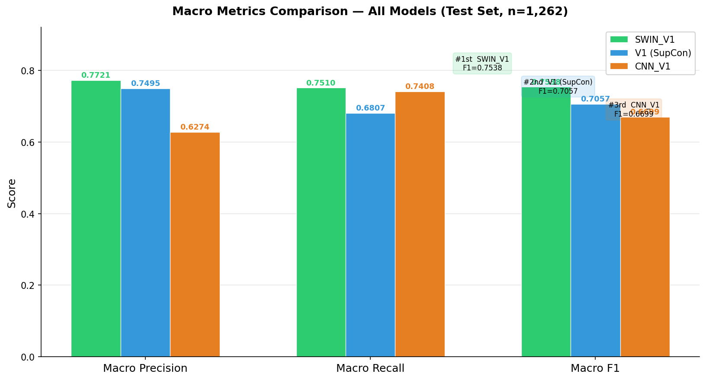
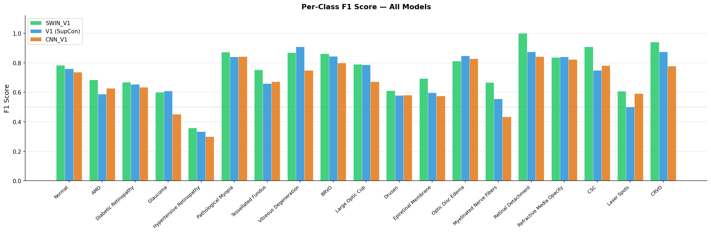
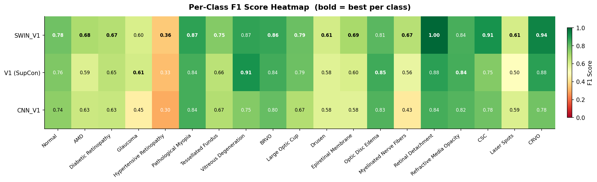
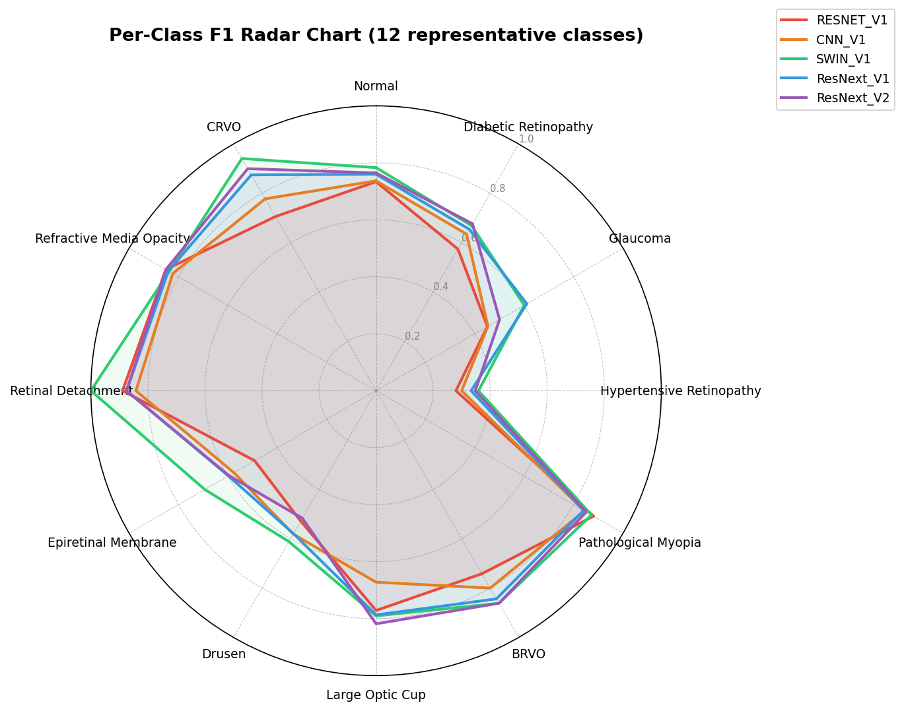
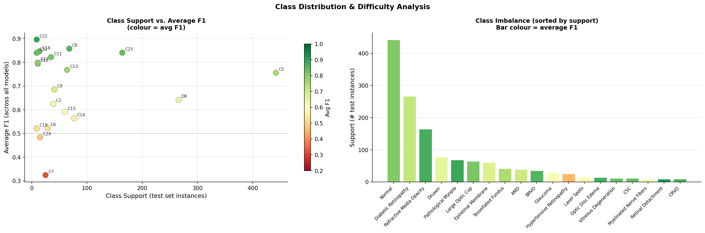
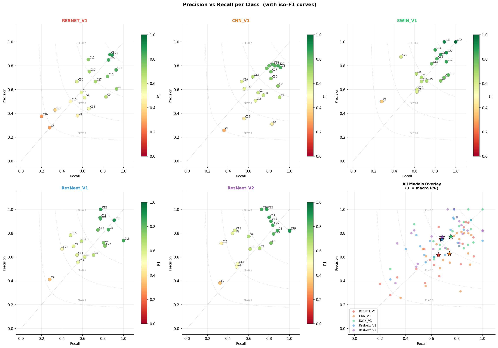

# RetinaScan — Multi-Label Retinal Disease Classification

> A production-ready deep learning system that classifies **19 retinal pathologies** from a single fundus photograph — complete with GradCAM explainability, a React web interface, and Docker deployment.

---

## What is RetinaScan?

RetinaScan is an end-to-end AI diagnostic assistant for **fundus (retinal) image analysis**. Given a fundus photograph, it simultaneously detects multiple co-occurring ocular diseases, highlights the regions driving each prediction with GradCAM heatmaps, and presents everything through an interactive web application.

The system handles the extreme class imbalance typical of real-world ophthalmic datasets through per-class threshold optimization and class-weighted loss functions — resulting in strong performance even on rare conditions with very few training samples.

### Where Can It Be Used?

- **Ophthalmology clinics** — decision-support tool for preliminary screening
- **Telemedicine platforms** — automated triage for remote fundus imaging
- **Public health programs** — mass screening for diabetic retinopathy and glaucoma
- **Medical education** — visual explanation of disease manifestations via GradCAM
- **Research** — benchmark platform for retinal AI model development

---

## Features

- **19-class multi-label classification** — detects multiple co-occurring conditions per image
- **Automated fundus preprocessing** — black-border removal → Hough Circle detection → CLAHE illumination normalization
- **Three training paradigms** — standard fine-tuning, Supervised Contrastive Learning (SupCon), and Swin Transformer
- **Per-class threshold optimization** — per-disease optimal thresholds found on validation set, maximizing Macro F1
- **GradCAM explainability** — heatmaps, polygon segmentation, and bounding boxes for every predicted class
- **Interactive web UI** — React frontend with drag-and-drop upload, multi-tab visualization
- **FastAPI backend** — REST inference API with health checks and structured JSON responses
- **Docker Compose deployment** — single command to launch the full stack (API + frontend + nginx)
- **GPU/CPU flexible** — runs on CPU by default; GPU enabled via a single config flag
- **Comprehensive evaluation** — 5-model comparison with per-class precision, recall, F1 and confusion matrices

---

## Model Results

Five model architectures were trained and evaluated on the same held-out test set (n = 1,262 images, 19 classes).

| Model | Architecture | Macro Precision | Macro Recall | Macro F1 |
|:------|:-------------|:---------------:|:------------:|:--------:|
| **SWIN_V1** ★ | Swin-Large (ImageNet-22k) | **0.7721** | **0.7510** | **0.7538** |
| ResNext_V2 | ResNeXt-50 + SupCon 3-stage | 0.7495 | 0.6807 | 0.7114 |
| ResNext_V1 | ResNeXt-50 + SupCon 2-stage | — | — | 0.7057 |
| CNN_V1 | ConvNeXt-Base fine-tuning | 0.6274 | 0.7408 | 0.6699 |
| RESNET_V1 | ResNet-50 fine-tuning | — | — | 0.6266 |

★ SWIN_V1 is the production model used by the API.

### Per-Class Results — SWIN_V1 (Test Set)

| Code | Disease | Threshold | Precision | Recall | F1 | Support |
|:----:|:--------|:---------:|:---------:|:------:|:--:|:-------:|
| C0 | Normal | 0.10 | 0.7013 | 0.8869 | **0.7832** | 442 |
| C1 | AMD | 0.55 | 0.7027 | 0.6667 | **0.6842** | 39 |
| DR | Diabetic Retinopathy | 0.45 | 0.7321 | 0.6165 | **0.6694** | 266 |
| C6 | Glaucoma | 0.40 | 0.5806 | 0.6207 | **0.6000** | 29 |
| C7 | Hypertensive Retinopathy | 0.20 | 0.5000 | 0.2800 | **0.3590** | 25 |
| C8 | Pathological Myopia | 0.80 | 0.8923 | 0.8529 | **0.8722** | 68 |
| C9 | Tessellated Fundus | 0.15 | 0.6731 | 0.8537 | **0.7527** | 41 |
| C10 | Vitreous Degeneration | 0.10 | 0.8333 | 0.9091 | **0.8696** | 11 |
| C11 | BRVO | 0.60 | 0.9333 | 0.8000 | **0.8615** | 35 |
| C13 | Large Optic Cup | 0.90 | 0.8167 | 0.7656 | **0.7903** | 64 |
| C14 | Drusen | 0.35 | 0.6000 | 0.6234 | **0.6115** | 77 |
| C15 | Epiretinal Membrane | 0.10 | 0.6719 | 0.7167 | **0.6935** | 60 |
| C18 | Optic Disc Edema | 0.20 | 0.7222 | 0.9286 | **0.8125** | 14 |
| C19 | Myelinated Nerve Fibers | 0.20 | 0.6667 | 0.6667 | **0.6667** | 9 |
| C22 | Retinal Detachment | 0.10 | 1.0000 | 1.0000 | **1.0000** | 9 |
| C25 | Refractive Media Opacity | 0.25 | 0.8590 | 0.8171 | **0.8375** | 164 |
| C27 | CSC | 0.45 | 0.9091 | 0.9091 | **0.9091** | 11 |
| C29 | Laser Spots | 0.40 | 0.8750 | 0.4667 | **0.6087** | 15 |
| C32 | CRVO | 0.10 | 1.0000 | 0.8889 | **0.9412** | 9 |
| | **Macro** | | **0.7721** | **0.7510** | **0.7538** | 1262 |

### Comparison Charts

<table>
<tr>
  <td></td>
  <td></td>
</tr>
<tr>
  <td><em>Overall macro-level metric comparison across all 5 models</em></td>
  <td><em>Per-class F1 scores across models</em></td>
</tr>
<tr>
  <td></td>
  <td></td>
</tr>
<tr>
  <td><em>Per-class F1 heatmap (models × classes)</em></td>
  <td><em>Radar chart of class-level performance</em></td>
</tr>
<tr>
  <td></td>
  <td></td>
</tr>
<tr>
  <td><em>Class support (sample size) vs. achieved F1</em></td>
  <td><em>Precision-Recall trade-off scatter per class</em></td>
</tr>
</table>

---

## Supported Disease Classes (19)

| Code | Disease | Code | Disease |
|:----:|:--------|:----:|:--------|
| C0 | Normal | C14 | Drusen |
| C1 | Age-Related Macular Degeneration (AMD) | C15 | Epiretinal Membrane |
| DR | Diabetic Retinopathy (DR) | C18 | Optic Disc Edema |
| C6 | Glaucoma | C19 | Myelinated Nerve Fibers |
| C7 | Hypertensive Retinopathy | C22 | Retinal Detachment |
| C8 | Pathological Myopia | C25 | Refractive Media Opacity |
| C9 | Tessellated Fundus | C27 | Central Serous Chorioretinopathy (CSC) |
| C10 | Vitreous Degeneration | C29 | Laser Spots |
| C11 | BRVO (Branch Retinal Vein Occlusion) | C32 | CRVO (Central Retinal Vein Occlusion) |
| C13 | Large Optic Cup | | |

Each image can carry **multiple concurrent labels** (up to 8 co-occurring conditions observed in the dataset).

---

## Architecture

### System Architecture

```
┌─────────────────────────────────────────────────────────┐
│                    Docker Compose                        │
│                                                         │
│  ┌──────────────────────┐    ┌───────────────────────┐  │
│  │    APP (nginx:80)    │    │     API (uvicorn:8000) │  │
│  │                      │    │                        │  │
│  │  React 18 + Vite     │───▶│  FastAPI               │  │
│  │  Tailwind CSS        │    │  ├─ /health            │  │
│  │  TypeScript          │    │  ├─ /classes           │  │
│  │                      │    │  └─ /predict           │  │
│  │  nginx proxies       │    │                        │  │
│  │  /api/* → api:8000   │    │  predictor.py          │  │
│  └──────────────────────┘    │  ├─ Preprocessing      │  │
│         localhost:3000       │  ├─ Swin-Large model   │  │
│                              │  ├─ Sigmoid + threshold│  │
│                              │  └─ GradCAM heatmaps   │  │
│                              └───────────────────────┘  │
└─────────────────────────────────────────────────────────┘
```

### Inference Pipeline

```
Raw fundus image (JPEG/PNG)
        │
        ▼
┌─────────────────────────────────┐
│         Preprocessing           │
│  1. Remove black borders        │
│  2. Hough Circle → fundus crop  │
│  3. CLAHE illumination norm     │
│  4. Resize to 224×224           │
│  5. ImageNet normalization      │
└────────────────┬────────────────┘
                 │
                 ▼
┌─────────────────────────────────┐
│      Swin-Large Backbone        │
│  swin_large_patch4_window7_224  │
│  (ImageNet-22k pretrained)      │
│  → 1536-d global pooled features│
└────────────────┬────────────────┘
                 │
                 ▼
┌─────────────────────────────────┐
│       Classification Head       │
│  Linear(1536→512) → GELU        │
│  → Dropout(0.3)                 │
│  → Linear(512→19) → Sigmoid     │
└────────────────┬────────────────┘
                 │
                 ▼
┌─────────────────────────────────┐
│    Per-class Threshold Filter   │
│  Each class has its own optimal │
│  threshold (0.10 – 0.90)        │
└────────────────┬────────────────┘
                 │
                 ▼
┌─────────────────────────────────┐
│       GradCAM Visualization     │
│  For each predicted class:      │
│  ├─ Heatmap overlay             │
│  ├─ Polygon segmentation        │
│  ├─ Bounding box extraction     │
│  └─ 2×2 comparison panel        │
└────────────────┬────────────────┘
                 │
                 ▼
          JSON Response
   (predictions + base64 visuals)
```

### Training Pipeline

```
Dataset (8,410 images, multi-hot labels)
         │
    ┌────┴───────────────────────┐
    │         Preprocessing       │
    │  Border removal → CLAHE     │
    │  → Circle crop → 224×224    │
    └────────────┬───────────────┘
                 │
    ┌────────────┴───────────────┐
    │         Augmentation        │
    │  RandomScalePadCrop         │
    │  H/V Flip, Rotation ±15°   │
    │  Grayscale (20% prob)       │
    └────────────┬───────────────┘
                 │
    ┌────────────┴───────────────────────────────┐
    │              Training Loop                  │
    │  Optimizer : AdamW (weight_decay=1e-2)      │
    │  LR schedule: warmup (5ep) → cosine (95ep)  │
    │  Differential LR: backbone 2e-5, head 1e-4  │
    │  Loss: BCEWithLogitsLoss (class weights)     │
    │  Gradient clipping: max_norm=1.0             │
    └────────────┬───────────────────────────────┘
                 │
    ┌────────────┴───────────────┐
    │    Threshold Optimization   │
    │  Sweep 0.05–0.95 per class  │
    │  on validation set          │
    │  → maximize Macro F1        │
    └────────────────────────────┘
```

---

## Repository Structure

```
FUNDUS/
├── docker-compose.yml              # Orchestrates api + app containers
├── requirements.txt                # Python dependencies (training/inference)
│
├── TRAINING/                       # Model training pipelines
│   ├── config.py                   # 19-class label mappings
│   ├── dataset.py                  # FundusDataset (multi-hot labels, image loading)
│   ├── preprocessing.py            # Border removal, Hough Circle, CLAHE
│   ├── augmentation.py             # ScalePadCrop, flips, rotation, grayscale
│   ├── train_swin.py               # ★ Swin-Large pipeline (production model)
│   ├── train_CNN.py                # ConvNeXt-Base pipeline
│   ├── train_resnext.py            # ResNeXt-50 Supervised Contrastive pipeline
│   └── train_resnet.py             # ResNet-50 baseline
│
├── API/                            # FastAPI inference backend
│   ├── Dockerfile                  # python:3.11-slim + CPU PyTorch
│   ├── requirements.txt
│   ├── main.py                     # Routes: /health, /classes, /predict
│   ├── predictor.py                # Model loading, GradCAM, inference logic
│   ├── visualizer.py               # GradCAM overlays, contours, bounding boxes
│   └── test_api.py
│
├── APP/                            # React/Vite frontend
│   ├── Dockerfile                  # Multi-stage: node build → nginx serve
│   ├── nginx.conf                  # SPA fallback + /api proxy
│   ├── package.json                # React 18, Tailwind, TypeScript, Vite
│   └── src/
│       ├── App.tsx                 # Main reducer-based state machine
│       ├── types.ts                # TypeScript interfaces
│       ├── lib/api.ts              # API client (FormData upload, base64 decode)
│       └── components/
│           ├── UploadArea.tsx      # Drag-and-drop file input
│           ├── ResultTabs.tsx      # Heatmap / polygon / bbox / comparison tabs
│           ├── PredictionList.tsx  # Sorted disease predictions with probabilities
│           └── ImagePreview.tsx    # Preprocessed fundus image display
│
├── DATASET/
│   ├── filtered_data_split.csv     # 8,410 images with train/val/test split labels
│   ├── split_stats.txt             # Train:5886 | Val:1261 | Test:1262
│   └── data/                       # Source fundus images
│
├── EXPERIMENTS/
│   ├── SWIN_V1/                    # ★ Production model
│   │   ├── best_swin.pt            # Checkpoint (Swin-Large, 89 MB)
│   │   ├── swin_evaluation.txt     # Per-class results (Macro F1=0.7538)
│   │   ├── training_curves.png
│   │   └── confusion_matrices.png
│   ├── CNN_V1/                     # ConvNeXt-Base (F1=0.6699)
│   ├── ResNext_V1/ & ResNext_V2/   # SupCon variants (F1=0.7057 / 0.7114)
│   ├── RESNET_V1/                  # ResNet-50 baseline (F1=0.6266)
│   └── COMPARISON/                 # 9 cross-model comparison charts
│       ├── 01_macro_metrics.png
│       ├── 02_perclass_f1_bars.png
│       ├── 03_perclass_f1_heatmap.png
│       ├── 04_radar_chart.png
│       ├── 05_win_loss.png
│       ├── 06_f1_delta.png
│       ├── 07_training_curves.png
│       ├── 08_support_vs_f1.png
│       └── 09_precision_recall_scatter.png
│
├── INFERENCE/                      # Standalone inference scripts
│   ├── inference_SWIN.py
│   ├── inference_ResNext_SupCon.py
│   ├── segmentation.py
│   ├── evaluate_predictions.py
│   └── INFERENCE RESULTS/          # Output predictions and visualizations
│
├── DATA CLEANING/                  # Data curation and filtering scripts
├── DATA STATISTICS/                # Dataset analysis and class distribution plots
├── DOCUMENTS/                      # Research papers and design notes
└── UTILS/                          # Shared utility functions
```

---

## Dataset

| Split | Images |
|:------|-------:|
| Training | 5,886 |
| Validation | 1,261 |
| Test | 1,262 |
| **Total** | **8,410** |

- Multi-hot label vectors — each image can have 1 to 8 concurrent conditions
- Labels loaded from `DATASET/filtered_data_split.csv`
- Source: ODIR (Ocular Disease Intelligent Recognition) dataset

---

## Quick Start — Docker (Recommended)

The entire stack (API + frontend) runs with a single command.

**Prerequisites:** [Docker](https://docs.docker.com/get-docker/) and [Docker Compose](https://docs.docker.com/compose/install/) installed.

### 1. Clone the repository

```bash
git clone https://github.com/Mahd-xylexa/FUNDUS.git
cd FUNDUS
```

### 2. Ensure the model checkpoint exists

```bash
ls EXPERIMENTS/SWIN_V1/best_swin.pt
```

> The checkpoint is mounted read-only into the API container. Download it separately if not present.

### 3. Build and start all services

```bash
docker compose up --build
```

This builds both containers and starts:
- **API** — FastAPI inference server (internal, not exposed directly)
- **APP** — React frontend at `http://localhost:3000`

All API calls from the frontend are proxied through nginx (`/api/*` → API service).

### 4. Open the application

```
http://localhost:3000
```

Upload a fundus image, click **Predict**, and view the disease predictions alongside GradCAM heatmaps, polygon segmentations, and bounding boxes.

### 5. Stop all services

```bash
docker compose down
```

### GPU Support

To enable GPU inference, edit `docker-compose.yml` and uncomment the `deploy` block under the `api` service, then set:

```yaml
environment:
  DEVICE: cuda
```

Ensure the [NVIDIA Container Toolkit](https://docs.nvidia.com/datacenter/cloud-native/container-toolkit/install-guide.html) is installed on the host before running.

---

## Local Development Setup

### Python (Training / Inference)

```bash
# Create virtual environment
python -m venv .venv
source .venv/bin/activate        # Windows: .venv\Scripts\activate

# Install dependencies
pip install -r requirements.txt
```

### Train Models

```bash
# Production model — Swin-Large Transformer
python TRAINING/train_swin.py

# ConvNeXt-Base fine-tuning
python TRAINING/train_CNN.py

# ResNeXt-50 Supervised Contrastive Learning
python TRAINING/train_resnext.py

# ResNet-50 baseline
python TRAINING/train_resnet.py
```

Checkpoints and evaluation results are saved to `EXPERIMENTS/<model_name>/`.

### Run Standalone Inference

```bash
# Swin-Large inference on test set
python INFERENCE/inference_SWIN.py

# Evaluate saved predictions
python INFERENCE/evaluate_predictions.py

# Compare all models
python EXPERIMENTS/compare_models.py
```

### Run API Locally

```bash
cd API
pip install -r requirements.txt
CHECKPOINT_PATH=../EXPERIMENTS/SWIN_V1/best_swin.pt uvicorn main:app --host 0.0.0.0 --port 8000 --reload
```

### Run Frontend Dev Server

```bash
cd APP
npm install
npm run dev          # http://localhost:5173
```

> Point the frontend at your local API by setting `VITE_API_BASE_URL=http://localhost:8000` in `APP/.env`.

---

## API Reference

Base URL (Docker): `http://localhost:3000/api`  
Base URL (local): `http://localhost:8000`

### `GET /health`

Returns liveness status and model info.

```json
{
  "status": "ok",
  "model": "swin_large_patch4_window7_224",
  "device": "cpu"
}
```

### `GET /classes`

Returns the list of 19 disease class names.

```json
{
  "classes": ["Normal", "AMD", "DR", ...]
}
```

### `POST /predict`

Upload a fundus image and receive predictions with GradCAM visualizations.

**Request:** `multipart/form-data` with field `file` (JPEG or PNG image).

**Response:**

```json
{
  "predictions": [
    {
      "class": "Pathological_Myopia",
      "probability": 0.91,
      "threshold": 0.80
    }
  ],
  "visualizations": {
    "heatmap": "<base64-encoded PNG>",
    "overlay": "<base64-encoded PNG>",
    "polygon": "<base64-encoded PNG>",
    "bbox": "<base64-encoded PNG>",
    "comparison": "<base64-encoded PNG>"
  }
}
```

---

## Tech Stack

| Layer | Technology |
|:------|:-----------|
| ML Framework | PyTorch 2.4.1 |
| Model | Swin-Large (timm) |
| Preprocessing | OpenCV, PIL |
| Explainability | GradCAM (pytorch-grad-cam) |
| Backend | FastAPI + Uvicorn |
| Frontend | React 18 + TypeScript + Vite |
| Styling | Tailwind CSS 3 |
| Serving | nginx 1.27 |
| Containerization | Docker + Docker Compose |

---

## License

This project is for research and educational purposes. For clinical deployment, validation against local regulatory standards is required.
